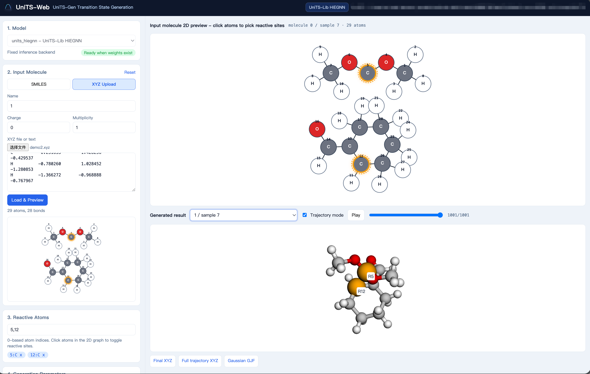

# UniTS-Web

<p align="center">
  
</p>


UniTS-Web is a lightweight Web UI for [UniTS](https://github.com/licheng-xu-echo/UniTS) transition-state initial guess generation. It is designed for the UniTS-Lib HiEGNN checkpoint, `units_hiegnn`, and supports SMILES or XYZ molecule input, reactive atom selection, batched sampling, trajectory visualization, and downloads for final XYZ, full trajectory XYZ, and Gaussian `.gjf` input files. Related paper: https://www.nature.com/articles/s41467-026-77230-8.

The project does not require Node.js, Vite, FastAPI, or Flask. The backend uses Python's standard-library HTTP server, and the frontend is static HTML/CSS/JavaScript. The 3D viewer uses a local copy of `3Dmol-min.js`, so the app can run on both Linux and Windows inside the UniTS Python environment.

## Features

- Enter SMILES or upload/paste XYZ input.
- Parse the input molecule into a clickable 2D molecular graph.
- Select 0-based reactive atom indices by clicking atoms or typing them manually.
- Set `charge` and `multiplicity` independently for each molecule.
- Batch same-type queued molecules into one UniTS CLI call with aligned `reactive_atom_idx`, `charge`, and `multi` arguments.
- Run multiple molecules and multiple samples per molecule with configurable `batch_size`.
- Show inference progress and live UniTS logs.
- Stop a running generation job from the UI.
- Visualize final 3D structures and saved generation trajectories in the browser.
- Download final XYZ, full trajectory XYZ, and Gaussian GJF files.

## Project Layout

```text
UniTS-Web/
├── app.py
├── start.py
├── README.md
├── LICENSE
├── static/
│   ├── index.html
│   ├── styles.css
│   ├── app.js
│   ├── logo.svg
│   └── vendor/
│       └── 3Dmol-min.js
└── data/
    └── jobs/
```

Generated results are stored under:

```text
UniTS-Web/data/jobs/<job_id>/
```

## Configure The UniTS Environment

Run UniTS-Web inside the UniTS Python environment. The commands below follow the current UniTS installation workflow.

```bash
conda create -n units python=3.11
conda activate units
```

Install QCBot:

```bash
git clone https://github.com/licheng-xu-echo/QCBot.git
cd QCBot
pip install .
cd ..
```

Install UniTS:

```bash
git clone https://github.com/licheng-xu-echo/UniTS.git
cd UniTS
unzip MolOP-main.zip
cd MolOP-main
pip install -e .
cd ..
```

Install the UniTS package. For a standard CUDA 12.4 environment:

```bash
pip install . -f https://data.pyg.org/whl/torch-2.4.0+cu124.html --extra-index-url https://download.pytorch.org/whl/cu124
```

For RTX 50 series GPUs or other GPUs requiring `sm_120`, use the CUDA 12.8 setup provided by UniTS:

```bash
cp pyproject_sm_120.toml pyproject.toml
pip install . -f https://data.pyg.org/whl/torch-2.8.0+cu128.html --extra-index-url https://download.pytorch.org/whl/cu128
```

UniTS-Web also needs the molecule parsing and inference dependencies used by UniTS, including RDKit, OpenBabel, PyTorch, PyG, MolOP, and QCBot. A working UniTS installation should satisfy these requirements.

## Download Model Weights

UniTS-Web uses only the UniTS-Lib HiEGNN model:

```text
UniTS/units/model_path/units_hiegnn/args.npy
UniTS/units/model_path/units_hiegnn/best_full_model.pth
```

If the checkpoint is missing, download it from the UniTS root directory:

```bash
cd /path/to/UniTS
pip install modelscope
modelscope download --model 'XuLiCheng2025/UniTS-Gen-v1' --include 'model_path/units_hiegnn/*' --local_dir './units'
```

After downloading, the expected layout is:

```text
UniTS/
└── units/
    └── model_path/
        └── units_hiegnn/
            ├── args.npy
            └── best_full_model.pth
```

## Run UniTS-Web

<p align="center">
  
</p>

Activate the UniTS environment and enter the UniTS-Web directory:

```bash
conda activate units
cd /path/to/UniTS-Web
```

### Linux / Remote Server

On a remote server, bind to `0.0.0.0`:

```bash
python start.py --host 0.0.0.0 --port 7860 --units-root /path/to/UniTS
```

If `UniTS-Web` and `UniTS` share the same parent directory, for example:

```text
/work/UniTS
/work/UniTS-Web
```

you can omit `--units-root`:

```bash
python start.py --host 0.0.0.0 --port 7860
```

Open the browser at:

```text
http://<server-ip>:7860
```

If you access the server through SSH port forwarding:

```bash
ssh -L 7860:127.0.0.1:7860 user@server
```

open:

```text
http://127.0.0.1:7860
```

### Windows

In Anaconda Prompt, cmd, or PowerShell:

```bat
conda activate units
cd C:\path\to\UniTS-Web
python start.py --host 127.0.0.1 --port 7860 --units-root C:\path\to\UniTS
```

Open:

```text
http://127.0.0.1:7860
```

### Environment Variables

You can also configure the server with environment variables.

Linux/macOS:

```bash
export UNITS_ROOT=/path/to/UniTS
export UNITS_WEB_HOST=0.0.0.0
export UNITS_WEB_PORT=7860
python start.py
```

Windows PowerShell:

```powershell
$env:UNITS_ROOT="C:\path\to\UniTS"
$env:UNITS_WEB_HOST="127.0.0.1"
$env:UNITS_WEB_PORT="7860"
python start.py
```

## Usage

1. Select `SMILES` or `XYZ Upload` in the left sidebar.
2. Enter a SMILES string, or upload/paste XYZ content.
3. Set `Charge` and `Multiplicity` for the current molecule.
4. Click `Load & Preview` to generate the 2D molecular graph.
5. Click atoms in the molecular graph, or type indices manually in `Reactive Atoms`.
6. Set `Samples per molecule`, `Batch size`, `Random seed`, and whether to save the full trajectory.
7. Click `Add molecule to queue`.
8. Repeat the input steps to add more molecules if needed.
9. Click `Generate TS Initial Guess`.
10. Click `Stop generation` if you need to terminate a running job.
11. Use `Generated result` to switch between samples and inspect final structures or trajectories.
12. Download `Final XYZ`, `Full trajectory XYZ`, or `Gaussian GJF`.

## Batched Inference Behavior

UniTS-Web groups queued molecules by input type:

- All SMILES molecules are passed to one `units.infer_smiles` call.
- All XYZ molecules are passed to one `units.infer_xyz` call.
- If the queue contains both SMILES and XYZ inputs, UniTS-Web runs two UniTS commands because UniTS provides separate entry points for these input types.

A batched SMILES call has the following shape:

```bash
units-infer-smiles \
  --smiles 'SMILES1' 'SMILES2' \
  --reactive_atom_idx site11,site12 site21,site22 \
  --charge chrg1 chrg2 \
  --multi multi1 multi2 \
  --model_type units_hiegnn \
  --num_samples 10 \
  --batch_size 10 \
  --output_dir ./ts_initial_guess
```

## Gaussian GJF Settings

The `Gaussian GJF Settings` panel at the bottom of the sidebar is collapsed by default. If you do not open it, UniTS-Web still uses the default GJF settings:

```text
nproc = 16
mem = 32GB
method = b3lyp
basis = def2svp
empirical_dispersion = gd3bj
```

Open the panel before generation if you need to change these Gaussian input settings.

## Notes

- Atom indices are 0-based and match the UniTS CLI convention.
- When a new SMILES or XYZ input is entered, the current atom index selection is cleared to avoid reusing indices from the previous molecule.
- `charge` and `multiplicity` are molecule-level settings and are stored with each queued molecule.
- `Samples per molecule`, `Batch size`, `Random seed`, and Gaussian settings are shared by the current queue job.
- If GPU memory allows, set `Batch size` close to or equal to `Samples per molecule`.
- XYZ input is used to recover the molecular graph and atom ordering; UniTS then generates TS initial guesses from the graph and reactive atom indices.
